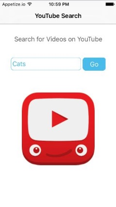

# YouTube Search App

A simple [YouTube Search App](https://appetize.io/app/jnhahxte9j2wwygntg5jummhjr?device=iphone5s&scale=75&orientation=portrait&osVersion=9.3) for iOS. Built with [React-Native](https://facebook.github.io/react-native/).

## Motivation

This was a flex-week project in the full-time [Thinkful Web Development Bootcamp](https://www.thinkful.com/bootcamp/web-development/full-time/).

The goal was to learn a new framework and create a project with it within one week. This was the first project I produced towards this goal. The idea was to create a simple user interface with a navigation component, and connect it to an API.

The app allows a user to query the [YouTube API](https://developers.google.com/youtube/), and view 10 results at a time, with the option to paginate to more results. The user can select any result to watch it's video.

## Technologies

| **Tech** | **Description** |
|----------|-------|
|  [CSS](https://developer.mozilla.org/en-US/docs/Web/CSS)  |   UI Styling    |
|  [React Native](https://facebook.github.io/react-native/)  |   Enables React to run natively on mobile devices using native UI components    |
|  [YouTube API](https://developers.google.com/youtube/)  |   Query and view YouTube content    |

## Develop

To develop this app:
- clone the repo
- run `npm install`
- open [Xcode](https://developer.apple.com/xcode/) if using OSX and developing for iOS
  - other development environments are available for [other platforms](https://facebook.github.io/react-native/docs/getting-started.html#content)
- a prototype can be deployed through [appetize.io](https://appetize.io/). A helpful tutorial to build the app for appetize deployment is available [here](https://medium.com/@callMeNorm/prototyping-react-native-with-appetize-io-752f6d303668#.y3kdtesme).

##
##### Contributers
* jpke
